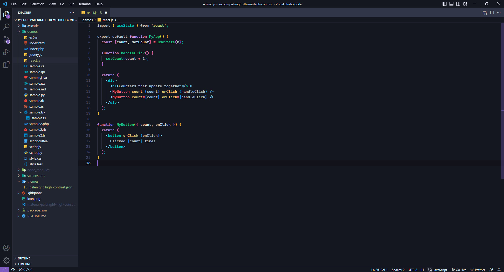
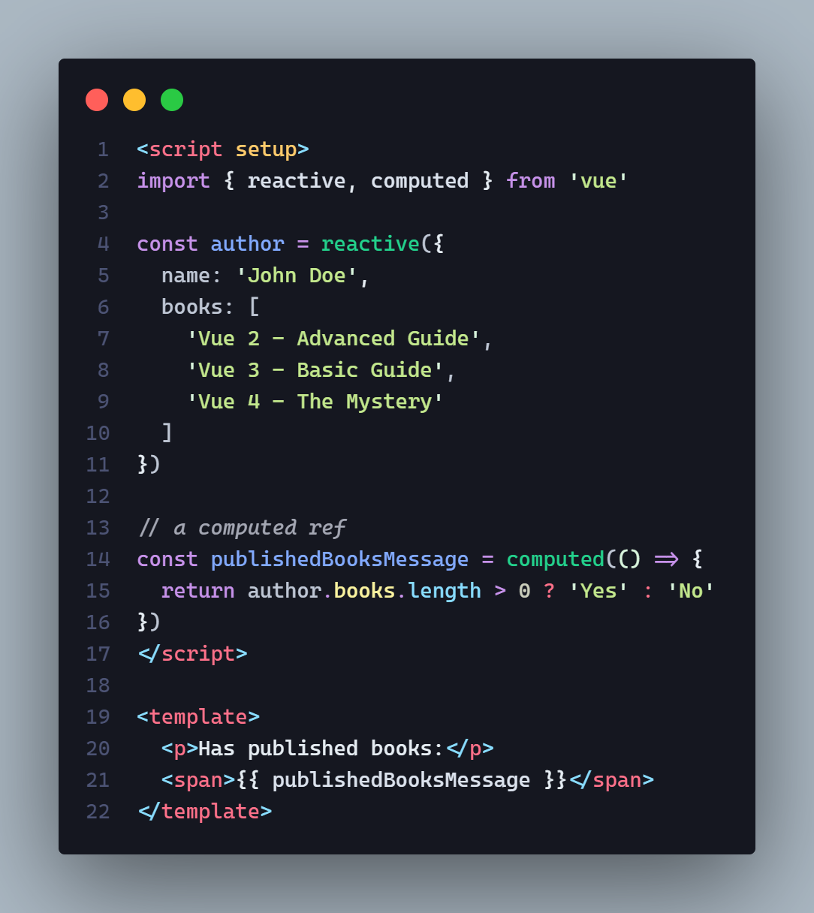
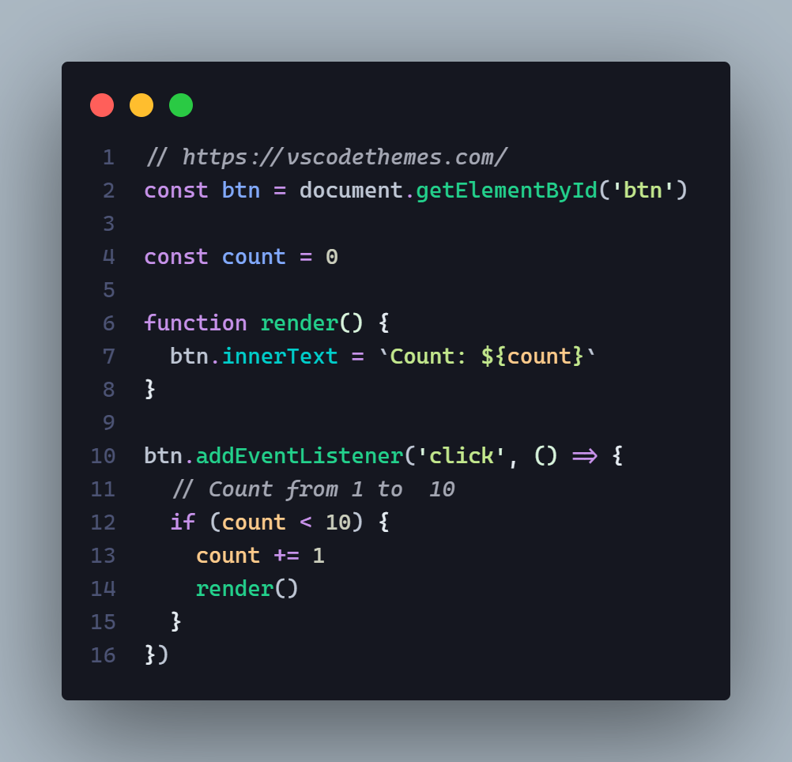
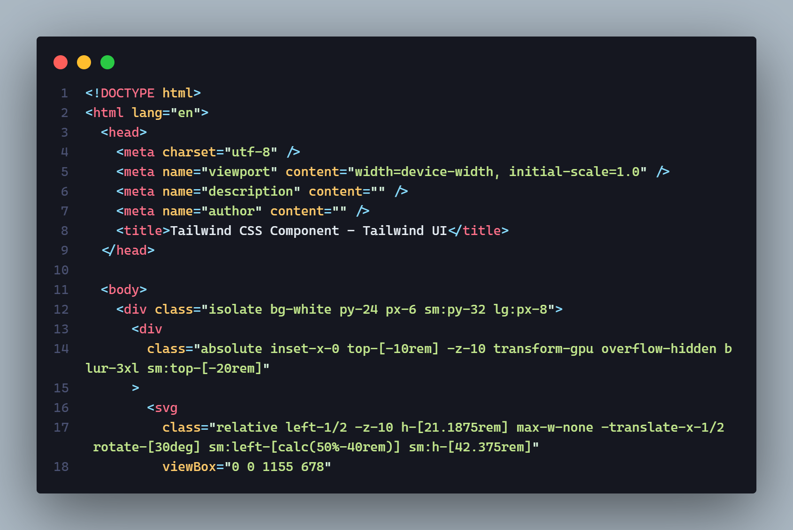

# Luminescence Theme 

This high-contrast theme is vastly easier on the eyes and reduces eye strain.

# What is High-Contrast Mode?

High-contrast mode is designed for users with weak eyesight to help them read text efficiently. The contrast of the screen is the ratio of the white color to the black. Setting the right contrast ratio is crucial for relaxing the eyes. Human eyes distinguish the best if white appears on a black background and vice versa. Hence, the contrast ratio should be higher for the eyes to lessen the stress on the eyes.

# High-Contrast theme benefits

1. Improves focus.
2. Improves visibility and readability.
3. Reduces visual noise.
4. Eases light sensitivity.
5. Reduces eye strain.
6. Eases light sensitivity.
7. Reduces visual noise
8. If a screen has flicker problems, dark backgrounds can reduce flickering.
9. Dark themes are less likely to trigger photophobia (sensitivity to light).
10. Light-colored text on a dark background can be easier to read for a long period of time.
11. Dark themes can make screens easier to use in low-light conditions.
12. Try to avoid low-contrast color schemes as they are stressful and result in eye strain and fatigue.

## Credits

The font used in the screenshot is [Cascadia Code](https://github.com/microsoft/cascadia-code/)
